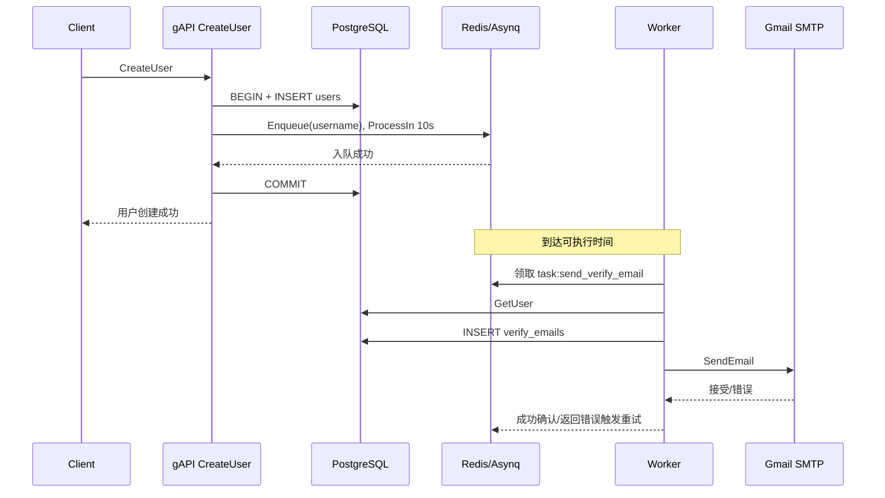
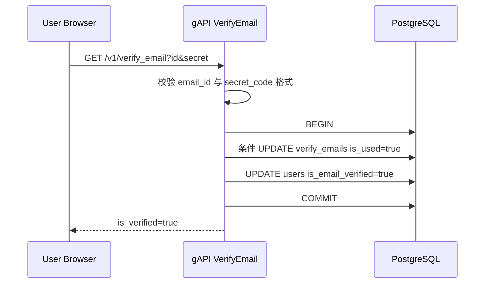
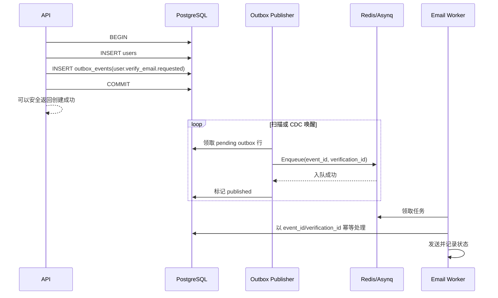

# 第 6 阶段：Redis、Asynq、异步任务与邮箱验证

> 面向读者：第一次接触消息队列、Redis、后台任务和邮件系统的 Go/后端初学者。
> 对应演进：`989ee8d`、`3b4582e`、`4ecbe7d`、`5709a87`、`3a7c914`、`12e55eb`、`7aa3d0b`、`dadeef1`、`e8fa39e`、`a50ac86`。
> 学习目标：不止会调用 Asynq API，而是能解释异步系统为什么存在、可能丢什么或重复什么，以及怎样把它做成可信的生产系统。

---

## 1. 先建立全局认识：为什么注册用户不直接发送邮件

设想注册接口按以下顺序同步执行：

1. 校验参数；
2. 把用户写入 PostgreSQL；
3. 连接 Gmail SMTP；
4. 完成握手、认证、传输邮件；
5. SMTP 服务器接受邮件后才返回响应。

这条链路逻辑直观，但数据库和邮件服务被绑在了一次请求里。数据库写入可能只需要几十毫秒，SMTP 却可能因为 DNS、TLS、网络拥塞、供应商限流而耗费数秒，甚至超时。于是会出现：

- 用户一直等待，接口的 P95/P99 延迟被最慢的外部依赖决定；
- 邮件供应商短暂故障，注册接口也跟着失败；
- 大量注册请求同时到来时，大量请求 goroutine 都在等待 SMTP；
- 重试责任落在客户端身上，客户端重试又可能重复创建用户或重复发信；
- 邮件发送能力无法独立扩缩容。

异步方案在 API 和邮件发送之间加入一个持久化任务队列：API 只声明“需要发送验证邮件”，Worker 在后台完成实际发送。

```text
同步：客户端 ──> API ──> PostgreSQL ──> SMTP ──> API 响应

异步：客户端 ──> API ──> PostgreSQL
                         └──> 任务队列 ──> API 响应
                                      └──> Worker ──> SMTP
```

异步不是“把函数前面加一个 `go`”这么简单。`go sendEmail()` 只把工作交给当前进程的一条 goroutine：进程重启后内存里的任务消失；发送失败没有持久化重试；运行多个实例时也缺少统一调度。真正的后台任务系统至少要回答：任务存在哪里、谁来取、失败后怎么办、执行两次会怎样、系统关闭时正在执行的任务怎么办。

### 1.1 同步和异步不是谁绝对更好

适合同步的工作通常具有以下特征：

- 调用方必须立刻知道结果，例如登录密码是否正确；
- 后续操作依赖结果，例如转账是否提交；
- 工作很快且依赖少；
- 失败不能被延后处理。

适合异步的工作通常是：

- 邮件、短信、Push 通知；
- 图片转码、报表生成；
- 搜索索引更新、缓存预热；
- 审计事件和数据同步；
- 可以接受“稍后完成”的操作。

异步降低了请求延迟并隔离故障，但代价是**最终一致性**：注册成功时，邮件未必已发出；还要处理重复、乱序、积压、重试和监控。工程判断不是“尽量异步”，而是把用户必须立即获得的强一致结果留在同步事务里，把可延后的副作用交给可靠异步流程。

---

## 2. 消息队列的基本模型

本项目使用 Asynq。它是 Go 的 Redis-backed task queue：Asynq 提供任务状态、调度、重试、Worker 并发等抽象，Redis 保存和协调任务数据。

最基本的角色有四个：

| 角色 | 在本项目中的对应物 | 职责 |
|---|---|---|
| Producer / 生产者 | `RedisTaskDistributor` | 把任务序列化并入队 |
| Broker / 队列存储 | Redis | 保存待执行、延迟、重试等任务状态，协调多个 Worker |
| Consumer / 消费者 | Asynq Server | 从队列取得任务并管理执行生命周期 |
| Handler / 处理器 | `ProcessTaskSendVerifyEmail` | 执行业务：查用户、建验证码、发邮件 |

这里的“消息”和“任务”略有侧重：消息系统常强调事件传播，一个事件可由多个订阅者各自消费；任务队列常强调把一份工作交给某个 Worker 完成，多个 Worker 是竞争消费者。SimpleBank 的验证邮件属于后者：一份任务正常情况下只需一个 Worker 处理。

### 2.1 Push、Pull 与竞争消费者

消费者可以由 Broker 主动推送，也可以主动拉取。Asynq 隐藏了底层细节，Worker Server 持续从 Redis 获取可执行任务。启动多个相同 Worker 时，它们竞争任务，从而提高吞吐量；某个 Worker 宕机时，其他 Worker 可继续工作。

竞争消费者带来两个结论：

1. 不应依赖同一 Worker 的本地内存保存业务状态；
2. 不应假设任务只会由某台固定机器执行。

### 2.2 任务生命周期

为了形成正确心智模型，可以把任务理解为在若干状态间迁移：

```text
                  ProcessIn / ProcessAt
入队 ───────────────> scheduled
 │                         │ 到期
 └──────────────> pending <┘
                       │ Worker 领取
                       v
                    active
                   /      \
                成功       失败
                /           \
        completed/删除     retry ──到期──> pending
                                \
                          重试耗尽或 SkipRetry
                                  \
                                  archived
```

“死信队列”是行业通用概念：无法自动成功的消息被隔离，等待人工检查或重新投递。Asynq 当前版本使用 archived（归档）状态承载类似职责；不要把术语机械等同，重要的是建立运维流程：谁查看、何时告警、修复后如何重放、如何避免重放产生第二次副作用。

### 2.3 Redis 在这里究竟做什么

Redis 不只是缓存。它也能存储队列、延迟集合、锁和任务元数据，Asynq 通过 Redis 原子操作和数据结构协调多个生产者与消费者。SimpleBank 的 Redis 地址来自配置，Compose 中服务名是 `redis`，容器内地址为 `redis:6379`。

但“用了 Redis”不自动等于“任务永不丢失”。可靠性还受以下因素影响：

- Redis 是否启用 RDB/AOF 持久化；
- AOF 刷盘策略允许损失多大的时间窗口；
- 是否有主从复制和自动故障转移；
- 故障转移时是否可能丢失尚未复制的写；
- Redis 是否有内存上限和淘汰策略；
- 是否备份、演练恢复；
- 客户端超时、网络分区和部署拓扑。

当前 `docker-compose.yaml` 给 PostgreSQL 配置了卷，却没有给 Redis 配置持久化卷，也没有展示 AOF、复制或高可用配置。它适合本地学习，不能由此推导出生产级耐久性。

---

## 3. 任务契约：类型、载荷与序列化

`worker/task_send_verify_email.go` 定义了任务类型和载荷：

```go
const TaskSendVerifyEmail = "task:send_verify_email"

type PayloadSendVerifyEmail struct {
    Username string `json:"username"`
}
```

生产者使用 `json.Marshal` 把 Go struct 转为字节，再用 `asynq.NewTask` 组合任务类型与载荷。消费者用 `json.Unmarshal` 恢复结构。任务类型用于路由：`ServeMux` 把 `task:send_verify_email` 注册给 `ProcessTaskSendVerifyEmail`。

这就是一个跨时间、甚至跨进程的契约。代码发布后，队列中可能仍躺着旧版本任务，因此载荷演进必须考虑兼容性：

- 新增可选字段通常比较安全；
- 删除或重命名字段可能使旧任务无法解析；
- 改变字段含义最危险，即便 JSON 仍能解析，业务语义也可能错；
- 可以添加 `version` 字段，或用版本化任务类型如 `email.verify.v2`；
- Handler 应明确判断不支持的版本并隔离，不应无限重试。

项目只把 `Username` 放进任务，而不是把密码、完整 User 对象或邮件凭据塞进去，这是好方向。Worker 执行时重新查数据库，可以读到权威数据，也减少队列中的个人信息。但是它也产生一个语义选择：如果用户入队后修改邮箱，Worker 会向执行时查询到的新邮箱发信；如果业务希望验证“注册时的那个邮箱”，则应在事件中记录目标邮箱或绑定一个不可变的 verification ID。

### 3.1 为什么反序列化失败不该重试

当前代码：

```go
if err := json.Unmarshal(task.Payload(), &payload); err != nil {
    return fmt.Errorf("failed to unmarshal payload: %w", asynq.SkipRetry)
}
```

格式错误不会因为等待十秒而自行恢复，所以重试只会浪费资源。`errors.Is(err, asynq.SkipRetry)` 时，Asynq 不再自动重试而将任务归档。相反，SMTP 临时超时、数据库连接瞬断有可能自行恢复，适合重试。

错误分类是可靠异步系统的核心：

- **永久错误**：格式非法、不支持的版本、收件地址语法无效，直接归档或标记失败；
- **暂时错误**：超时、限流、临时网络故障，用退避策略重试；
- **业务终态**：用户已验证或验证码已撤销，通常应幂等地视为完成，而不是报错重试；
- **未知错误**：先有限重试，同时告警和保留上下文。

当前代码曾经对“用户不存在”显式使用 `SkipRetry`，但现在相关判断被注释，任何 `GetUser` 错误都会重试。若用户确实不存在，重试十次并不能修复它；生产实现应通过 `errors.Is(err, pgx.ErrNoRows)` 等稳定类型区分永久与暂时错误。

---

## 4. 队列优先级、延迟调度和并发

创建用户时，`gapi/rpc_create_user.go` 设置：

```go
opts := []asynq.Option{
    asynq.MaxRetry(10),
    asynq.ProcessIn(10 * time.Second),
    asynq.Queue(worker.QueueCritical),
}
```

含义分别是：任务失败后最多重试 10 次；最早约 10 秒后进入可处理状态；进入 `critical` 队列。`ProcessIn` 是“延迟至少一段时间后调度”，不是实时系统的精确闹钟，实际执行时间还受轮询、队列积压、Worker 是否存活等影响。

Worker 配置了：

```go
Queues: map[string]int{
    QueueCritical: 10,
    QueueDefault:   5,
}
```

在未启用 strict priority 的默认模式下，这些数值是加权优先级，不是“critical 永远先于 default”。两队列都有任务时，大体按权重选择，`10:5` 可理解为约 `2:1` 的取任务机会，从而避免低优先级队列永久饥饿。不能把它解释成两个队列分别有 10 和 5 个 goroutine。

并发由 Asynq `Config.Concurrency` 控制。项目没有显式设置该字段；本仓库锁定的 Asynq `v0.26.0` 在值小于等于零时会改为当前进程可用 CPU 数。这个默认值未必适合邮件任务：邮件发送是 I/O 密集，吞吐可能需要更高并发，但必须同时服从邮件供应商速率限制、数据库连接池容量和 Redis 压力。工业实践会压测后显式配置，而不是依赖机器 CPU 数隐式改变。

并发不是越大越好。若 Gmail 每秒只允许有限请求，100 个 Worker 会同时收到限流错误，然后一起重试，形成“重试风暴”。常见控制手段包括：

- Worker 全局并发上限；
- 按供应商或租户的速率限制；
- 指数退避并加入随机抖动；
- 熔断和降载；
- critical、default、bulk 使用不同 Worker 池，隔离大批量任务。

---

## 5. 重试、退避与交付语义

### 5.1 为什么不能立刻重试十次

若外部服务故障持续一分钟，连续立即重试十次只会在一秒内全部失败，并进一步加重故障。退避让每次重试间隔逐步变长，抖动（jitter）让不同任务不要同时醒来。

项目没有自定义 `RetryDelayFunc`。按当前依赖 Asynq `v0.26.0` 的源码，默认使用带随机量的指数型退避；教程不应把某个具体秒数当成业务承诺，因为库版本和重试次数都会影响结果。业务真正需要配置的是：最大尝试窗口、哪些错误可重试、供应商 `Retry-After`、任务过期时间和最终失败处理。

### 5.2 at-most-once、at-least-once、exactly-once

这三个术语描述的是交付或处理保证：

| 语义 | 直观含义 | 典型结果 |
|---|---|---|
| at-most-once | 最多处理一次，不重试 | 可能丢，但不会因队列重试重复 |
| at-least-once | 至少尝试成功一次，失败会重试 | 尽量不丢，但可能重复 |
| exactly-once | 业务效果恰好发生一次 | 需要非常严格的边界与协议，不能靠宣传口号获得 |

Asynq 的任务处理模型应按 **at-least-once** 来设计。一个经典的不确定窗口是：

```text
Worker 调用邮件服务成功
        ↓
Worker 进程在向 Redis 确认成功前崩溃
        ↓
任务恢复后再次执行
        ↓
第二封邮件被发送
```

队列无法凭空知道外部邮件服务是否已经接受第一封邮件。所谓 exactly-once 往往只能限定在单一事务系统内部，或通过幂等键、去重表和原子状态迁移实现“业务效果上的恰好一次”。跨 PostgreSQL、Redis、SMTP 三种资源，没有共同事务协调时，绝不能因为 Handler 正常只被调一次，就声称 exactly-once。

### 5.3 幂等：执行一次和执行多次，最终结果相同

例如 `UPDATE users SET is_email_verified = true` 天然接近幂等：执行一次或两次最终都为 true。`INSERT verify_emails ...` 和 `SendEmail(...)` 则不是：执行两次会多一行、发两封邮件。

本项目的 Handler 每次尝试都会先执行 `CreateVerifyEmail`，然后发送邮件。如果 SMTP 已接收邮件但客户端收到网络错误，Asynq 会重试；重试会再次插入一条验证码并再发一封。结果是同一用户有多个验证码，旧链接在各自 15 分钟有效期内仍可能有效，因为表上没有“同一用户只能有一个有效验证码”的约束，也没有撤销旧记录。

工业实现可以选择以下策略之一：

1. **稳定的 verification ID**：注册事务中创建唯一验证记录，任务只携带该 ID；重试读取同一记录，不再生成新验证码。
2. **幂等键**：为逻辑操作生成 `idempotency_key`，数据库建唯一索引；重复 Handler 只能取得同一发送记录。
3. **发送状态机**：`pending -> sending -> sent`，并记录 attempt、provider_message_id、last_error、next_attempt_at。状态更新用条件 UPDATE 防止并发 Worker 同时发送。
4. **供应商幂等键**：若邮件 API 支持，向供应商传同一 idempotency key。SMTP 协议本身通常不给应用一个通用的幂等发送保证。
5. **Asynq Unique 只是辅助**：它可在指定时间窗内拒绝重复入队，但去重锁有时间窗，且不能解决“已发送但确认丢失”；不能代替业务幂等。

即使采用状态机，跨数据库与供应商仍可能存在“供应商成功、数据库来不及标 sent”的窗口。因此更成熟的供应商 API、可查询 message ID、幂等请求，以及对重复邮件可接受性的业务设计都很重要。

---

## 6. 本项目的生产者与消费者代码

### 6.1 `TaskDistributor`：用接口隔离 Asynq

`worker/distributor.go` 定义：

```go
type TaskDistributor interface {
    DistributeTaskSendVerifyEmail(
        ctx context.Context,
        payload *PayloadSendVerifyEmail,
        opts ...asynq.Option,
    ) error
}
```

`RedisTaskDistributor` 内部持有 `*asynq.Client`，真正入队发生在 `EnqueueContext`。接口带来的价值不是“代码看起来高级”，而是 gRPC Server 依赖能力而非具体客户端：单元测试可注入 gomock 生成的 `MockTaskDistributor`，无需真实 Redis。

`ctx` 让入队操作继承请求取消或截止时间。但这也有边界：如果客户端刚取消请求，数据库事务可能已经执行到回调，而 Redis 入队因 ctx 取消失败，进而使事务回滚。Outbox 方案会把业务提交与请求连接生命周期进一步解耦。

当前构造函数返回接口而没有暴露 `Close`，`RedisTaskDistributor` 也没有关闭内部 `asynq.Client` 的方法。生产程序应在关闭阶段调用 Client 的 `Close`，释放 Redis 连接。

### 6.2 `TaskProcessor`：Server、Mux 和 Handler

`worker/processor.go` 创建 Asynq Server，并在 `Start` 时注册 Handler：

```text
Task type: task:send_verify_email
                 │
                 v
ProcessTaskSendVerifyEmail
```

Processor 注入了三个依赖：Asynq Server、`db.Store`、`mail.EmailSender`。这让 Handler 的业务边界清楚：队列负责调度，Store 负责数据库，Mailer 负责发送。

`ErrorHandler` 会记录任务类型、payload 和 error，Asynq 自身日志通过 `worker/logger.go` 适配到 zerolog。`5709a87` 正是补上错误处理和日志适配；`3a7c914` 修正任务日志字段。要注意当前 payload 只有 username，风险相对较小；如果未来 payload 含 token、邮箱或隐私字段，直接记录完整 bytes 会泄密，日志需要白名单和脱敏。

### 6.3 Handler 的真实执行顺序

当前 `ProcessTaskSendVerifyEmail`：

1. JSON 反序列化；
2. 按 username 查询用户；
3. 用 `util.RandomString(32)` 生成 secret code；
4. 插入 `verify_emails`；
5. 拼接验证 URL 和 HTML；
6. 通过 `EmailSender` 发邮件；
7. 记录成功日志；
8. 任一步返回错误，Asynq 根据错误和重试次数处理。

注意，步骤 3～6 没有一个跨资源事务。验证码插入成功、SMTP 失败时，数据库会保留一条未发送的验证记录；任务重试会再插一条。这不是 Go bug，而是分布式副作用的自然结果，必须通过业务状态与幂等设计解决。

---

## 7. SMTP 与 `mail/`：邮件不是“调用一个函数就送达”

SMTP 是邮件传输协议。应用通常把信交给一个 SMTP Submission 服务，服务再依据 DNS MX 等规则转交给接收方服务器。发送函数成功一般只表示上游 SMTP 服务接受了这封邮件，不代表它一定进入用户收件箱；后续仍可能退信、被反垃圾系统拒绝或进入垃圾箱。

`mail/sender.go` 用 `jordan-wright/email` 构造邮件，用标准库 `net/smtp` 的 `PlainAuth` 认证 Gmail：

- 认证主机：`smtp.gmail.com`；
- 服务器地址：`smtp.gmail.com:587`；
- 邮件正文：HTML；
- 支持 To、Cc、Bcc 和附件；
- 发件人姓名、地址、密码从配置注入。

端口 587 通常用于邮件提交并升级 TLS。不能把 `PlainAuth` 理解成“密码一定明文跑在公网”；标准库会限制其在 TLS 或本地主机连接中使用。不过真正的生产安全仍取决于 TLS 验证、凭据管理和供应商配置。

### 7.1 工业界如何选 SMTP 或邮件 API

小型系统可用 SMTP，优点是标准、可替换；规模化业务常使用 SES、SendGrid、Mailgun、Postmark 等供应商的 HTTPS API，因为它们通常提供结构化错误、模板、限流信息、message ID、事件 Webhook、退信与投诉处理。选择不是“API 一定更高级”，要结合成本、区域合规、可用性和迁移能力。

无论 SMTP 还是 API，生产环境都需要：

- 凭据放入 Secret Manager/Vault/Kubernetes Secret，并定期轮换；
- 配置 SPF、DKIM、DMARC，提高可达性并降低域名伪造；
- 处理 hard bounce、soft bounce、complaint、unsubscribe；
- 对永久退信地址停止持续发送，保护发信信誉；
- 记录供应商 message ID，但避免日志中出现验证码；
- 模板转义用户输入，防止 HTML 注入；
- 将营销邮件与交易邮件分流，验证邮件不能被批量营销任务拖死；
- 准备供应商故障策略，但不要无约束地双发导致重复。

### 7.2 当前真实 Gmail 测试意味着什么

`mail/sender_test.go` 是会连接 Gmail、发送真实邮件并附加 README 的集成测试。`7aa3d0b` 加入：

```go
if testing.Short() {
    t.Skip()
}
```

同时 Makefile 的 `test` 使用 `go test -v -cover -short ./...`，所以常规测试会跳过它。这是避免 CI 意外发邮件和依赖真实凭据的合理一步，但也意味着 `make test` 通过**不能证明 Gmail 集成仍可用**。

工业测试通常分层：

- 单元测试：Mock `EmailSender`，验证主题、收件人和模板参数；
- 本地集成：MailHog/Mailpit 等邮件捕获器，不向公网投递；
- 供应商沙箱或专用测试账户：受控执行；
- 少量定时合成监控：真实投递到测试邮箱并测量到达时间；
- 生产指标：接受率、退信率、投诉率和验证转化率。

---

## 8. 邮箱验证的数据库设计和事务

迁移 `000004_add_verify_emails.up.sql` 创建：

| 字段 | 含义 |
|---|---|
| `id bigserial` | 验证记录 ID |
| `username` | 用户名，外键指向 users |
| `email` | 此记录对应的邮箱 |
| `secret_code` | 验证秘密 |
| `is_used` | 是否已使用，默认 false |
| `created_at` | 创建时间 |
| `expired_at` | 过期时间，默认数据库当前时间加 15 分钟 |

同时给 `users` 增加 `is_email_verified bool NOT NULL DEFAULT false`。down migration 先删除验证表，再删除用户列。

这里用数据库时间产生过期时间，避免 API 和数据库机器时钟不同导致的额外偏差。`UpdateVerifyEmail` 的 WHERE 同时要求：

```sql
id = @id
AND secret_code = @secret_code
AND is_used = FALSE
AND expired_at > now()
```

只有所有条件成立才把 `is_used` 更新为 true 并返回行。并发点击同一链接时，行级更新竞争后最多一个请求能从 false 改成 true，另一个得不到返回行。这个“条件更新”比先 SELECT 再 UPDATE 更安全，因为检查和状态转换在一条 SQL 中原子完成。

`db/sqlc/tx_verify_email.go` 又把两步放进同一 PostgreSQL 事务：

1. 消耗验证记录；
2. 把对应用户 `is_email_verified` 改为 true。

若第二步失败，第一步也回滚，避免出现“验证码已经用掉，但用户仍未验证”。这是单一 PostgreSQL 资源内真正的 ACID 原子性。

### 8.1 当前验证数据的安全问题

当前实现还有四个关键问题：

1. `util.RandomString(32)` 使用 `math/rand`，并以当前时间播种。`math/rand` 适合测试数据和模拟，不适合生成攻击者不能猜测的秘密；应使用 `crypto/rand` 生成至少 128 bit 随机值，再用 base64url/hex 编码。
2. `secret_code` 明文存库。数据库只读泄露会让攻击者直接使用所有未过期链接。更稳妥的做法类似密码重置：邮件里发送原始 token，库中仅保存 `SHA-256(token)` 等哈希；收到 token 后哈希再常量时间比较。高熵随机 token 使用快速哈希即可，关键是熵足够，而不是照搬 bcrypt 的慢哈希。
3. URL 硬编码为 `http://localhost:8081/v1/verify_email?...`。生产链接必须来自经过校验的配置，使用受信域名和 HTTPS；不要从未经校验的 Host Header 拼接，否则可能产生 Host Header poisoning。
4. 验证码放在 query string。浏览器历史、代理、访问日志和 Referer 都可能记录完整 URL。常见缓解包括短时一次性 token、严格 Referrer-Policy、日志脱敏；前端先接收 token 再以 POST 提交也能减少后续传播，但首次 URL 仍需谨慎处理。

还应明确“验证的是哪个邮箱”。当前事务根据验证记录的 username 将用户标为已验证，却没有确认用户当前邮箱仍等于记录中的 email。如果用户在邮件发出后修改邮箱，旧邮箱链接仍可能把账户整体标为已验证。工业实现通常把验证状态绑定到当前 email/version，更新邮箱时自动置为未验证并撤销旧 token，验证时条件更新 `users.email = verification.email`。

### 8.2 反滥用与隐私

验证邮件接口容易被用来骚扰某个邮箱或消耗供应商额度。至少需要：

- 按 IP、账号、邮箱做分层速率限制；
- 重发设置冷却期和每日上限；
- 对“邮箱是否已注册”使用不泄露枚举信息的响应；
- 可疑流量启用 CAPTCHA/风险评分；
- 验证失败次数限制，短数字 OTP 尤其需要防暴力猜测；
- 不在日志、指标标签、Trace 中记录原始 token；
- 为验证记录设置保留期并清理过期数据；
- 遵循适用地区的隐私和数据保留规定；
- 邮件模板不要透露不必要的账户信息。

---

## 9. 两条完整时序：注册与验证

### 9.1 当前项目的注册和发信时序



务必注意图中的 PostgreSQL 和 Redis 是两个独立系统。`BEGIN/COMMIT` 的括号只包住 PostgreSQL；把 Redis 调用写在 Go 的事务回调里，并不会让 Redis 加入 PostgreSQL 事务。

### 9.2 当前项目的验证时序



`gapi/rpc_verify_email.go` 对事务错误统一返回 gRPC `Internal`，没有区分过期、已使用、错误 token 与数据库故障。对外统一信息能减少探测，但“无效链接”属于预期业务结果，不应污染服务端 5xx 指标；工业实现会对外给稳定、不过度泄露的业务响应，对内记录可观测的原因码。

---

## 10. 最容易误判的地方：`AfterCreate` 不是分布式事务

`db/sqlc/tx_create_user.go` 在 PostgreSQL 事务回调中执行：

```go
result.User, err = q.CreateUser(ctx, arg.CreateUserParams)
if err != nil {
    return err
}
return arg.AfterCreate(result.User)
```

而 `AfterCreate` 在 `gapi/rpc_create_user.go` 中调用 Redis 入队。它确实解决了一个方向的问题：如果入队明确失败，回调返回 error，`execTx` 会回滚用户 INSERT。但它无法解决所有时间窗口。

### 10.1 反例一：Redis 成功，PostgreSQL 最终提交失败

```text
PostgreSQL INSERT user 成功（尚未提交）
Redis Enqueue 成功，任务对 Worker 可见
PostgreSQL COMMIT 因网络/故障失败
```

结果可能是 Redis 有任务、数据库没有已提交用户。Worker 查询不到用户，然后重试或归档。更糟的是任务可能在数据库提交前就开始执行；项目用 `ProcessIn(10s)` 降低了概率，却不是正确性证明，提交也可能阻塞超过 10 秒。

### 10.2 反例二：提交结果不确定

数据库实际提交成功，但客户端在收到 COMMIT 响应前断线，应用可能认为失败。分布式系统中的超时只说明“我不知道结果”，不等于“对方没有执行”。如果上层盲目重试，就需要用户唯一约束和请求幂等来收敛。

### 10.3 为什么不能直接用两阶段提交

理论上分布式事务协议可以协调多个资源，但 Redis/Asynq/SMTP 并不共同参与这个 PostgreSQL XA 事务；两阶段提交还会引入锁持有、协调者故障和运维复杂度。邮件这类最终一致副作用，工业界更常用 Transactional Outbox。

---

## 11. Transactional Outbox：正确连接数据库事务与异步消息

Outbox 的核心是：**不要在业务事务中直接向 Redis 承诺消息，而是在同一个 PostgreSQL 事务里记录“将来必须发布的事实”。**

建议新增：

```sql
CREATE TABLE outbox_events (
    id             uuid PRIMARY KEY,
    aggregate_type text NOT NULL,
    aggregate_id   text NOT NULL,
    event_type     text NOT NULL,
    payload        jsonb NOT NULL,
    status         text NOT NULL DEFAULT 'pending',
    attempts       integer NOT NULL DEFAULT 0,
    available_at   timestamptz NOT NULL DEFAULT now(),
    created_at     timestamptz NOT NULL DEFAULT now(),
    published_at   timestamptz,
    last_error     text
);
```

正确流程：



为什么它正确：用户和 Outbox 行同属 PostgreSQL，一个提交要么同时存在，要么同时不存在，因此不会出现“用户已提交但发布意图完全丢失”。Publisher 宕机后可以继续扫描 pending 行。

但 Publisher 仍有一个重复窗口：Redis 入队成功后、标记 published 前崩溃，恢复后会再次入队。所以 Outbox 解决的是**不丢发布意图**，不自动解决重复；任务必须带稳定 event ID，消费者仍要幂等。可配合 Asynq TaskID/Unique 做队列侧去重，但业务数据库唯一约束才是最终防线。

### 11.1 Outbox Publisher 的并发处理

多个 Publisher 可用类似以下思路抢占批次：

```sql
SELECT ...
FROM outbox_events
WHERE status = 'pending' AND available_at <= now()
ORDER BY created_at
FOR UPDATE SKIP LOCKED
LIMIT 100;
```

`SKIP LOCKED` 让多个实例跳过已被其他事务锁定的行。不要在数据库事务中长时间等待网络入队，否则会长期持锁。一种实现是短事务 claim 为 processing 并设置 lease，事务外发布，再短事务标 published；若进程崩溃，过期 lease 由回收器恢复。另一种是 CDC（如读取 WAL）发布变更。两者都要有重试、告警、积压监控和清理策略。

### 11.2 邮件发送状态机建议

Outbox 与邮件发送记录最好分清职责：Outbox 保证事件发布，`email_deliveries` 管理邮件业务状态。例如：

```text
pending -> sending -> accepted -> delivered
              │          │
              │          ├-> bounced / complained
              └-> retry_wait -> sending
                         └-> permanently_failed
```

`accepted` 表示供应商接受，`delivered` 需要供应商 Webhook 才可能确认；二者不能混为“用户已看到”。每次状态迁移都保存时间、attempt、reason、provider message ID。Webhook 本身也会重复投递，因此要按 event ID 幂等。

---

## 12. 故障矩阵：逐个问“坏在这里会怎样”

| 故障点 | 当前行为 | 风险 | 工业处理 |
|---|---|---|---|
| JSON 无法解析 | `SkipRetry`，归档 | 任务不再自动执行 | 告警、检查生产者版本、提供安全重放工具 |
| Redis 在入队前不可用 | `AfterCreate` 返回错误，用户事务回滚 | 注册被队列可用性绑架 | PostgreSQL 同事务写 Outbox，异步发布 |
| Redis 入队成功后 DB COMMIT 失败 | 任务已可见 | 无用户的幽灵任务 | Outbox，不在业务事务中直接入队 |
| Worker 查用户时 DB 短暂断开 | 返回错误并重试 | 正常的暂态恢复 | 超时、退避、熔断、连接池监控 |
| Worker 查不到用户 | 当前也会重试 | 无效重试直至归档 | 稳定错误分类，永久错误不重试 |
| 验证记录插入成功，SMTP 失败 | 任务重试 | 多条有效验证码 | 稳定 verification ID、幂等键、状态机 |
| SMTP 接受后 Worker 崩溃 | 任务可能重做 | 重复邮件 | 供应商幂等能力、message ID、容忍与去重设计 |
| Worker 全部宕机 | Redis 积压 | 邮件延迟 | queue depth/oldest age 告警，自动扩容与值班流程 |
| Redis 重启且无可靠持久化 | 任务可能丢 | 用户永远收不到邮件 | Redis 持久化/HA，加 Outbox 可重新发布 |
| 用户重复点击链接 | 条件 UPDATE 只允许首次成功 | 后续返回事务错误 | 对外设计幂等成功页面或明确“已使用/过期” |
| 用户改邮箱后点旧链接 | 仍可能把用户标已验证 | 验证错邮箱 | token 绑定 email/version，条件更新当前邮箱 |
| 验证码库泄露 | secret 明文可直接使用 | 账户邮箱验证被绕过 | `crypto/rand` 高熵 token，只存哈希，短 TTL |
| 服务收到 SIGTERM | 当前无统一关闭流程 | 进行中请求/任务被中断 | signal context、停止接单、Worker Shutdown、关闭客户端与池 |

故障矩阵是设计异步系统的实用工具：每增加一个外部调用，就问“调用前崩溃、调用后崩溃、响应丢失、调用重复”四种情况。正常路径只占代码阅读的一小部分，系统可信度由故障路径决定。

---

## 13. `main.go` 的集成与生命周期

当前 `main`：

1. 创建 PostgreSQL 连接池；
2. 创建 Asynq Redis client 封装的 Distributor；
3. goroutine 启动 Task Processor；
4. goroutine 启动 HTTP Gateway；
5. 主 goroutine 运行 gRPC Server。

`runTaskProcessor` 创建 GmailSender 和 RedisTaskProcessor，随后调用 `Start()`。`TaskProcessor` 接口虽然定义了 `Shutdown()`，但 `main.go` 没有保存 Processor 并在退出时调用它；Distributor 内部 client 也没有 Close 暴露；pgxpool 同样未在 main 中 defer Close。程序也没有监听 SIGINT/SIGTERM 统一协调 HTTP、gRPC、Asynq、Redis 和 PostgreSQL 的关闭。

工业级关闭顺序通常是：

1. 接到 SIGTERM 后将 readiness 置为 false，让负载均衡不再送新请求；
2. 停止 HTTP/gRPC 接受新请求，并给在途请求有限宽限期；
3. 停止 Worker 领取新任务，等待当前 Handler 在截止时间内完成；
4. 未完成任务应由队列租约/恢复机制重新调度，因此 Handler 必须幂等；
5. 关闭 Asynq Client、Redis 连接、数据库连接池；
6. 超出总关闭期限才强制退出。

仅仅在 goroutine 中 `log.Fatal` 也值得警惕：Fatal 通常直接退出整个进程，defer 可能没有机会执行。更清晰的结构是通过 `errgroup` 汇总服务错误，由 main 统一 cancel、shutdown 和返回退出码。

Compose 还有一处真实边界：API 的 `depends_on` 只列 PostgreSQL，入口脚本也只等待 `postgres:5432`，没有等待 Redis；而 `depends_on` 本身通常也只表示启动顺序，不等于依赖已健康。生产和本地都应让客户端有合理连接重试、健康检查，并让 readiness 反映关键依赖状态。

---

## 14. 可观测性：没有指标的异步任务等于“用户说没收到才知道”

日志只能回答单个事件，异步系统还需要指标和 Trace。

### 14.1 建议指标

- `tasks_enqueued_total{type,queue}`：入队量；
- `tasks_processed_total{type,result}`：成功、暂时失败、永久失败；
- `task_processing_duration_seconds{type}`：处理耗时分布；
- `queue_depth{queue,state}`：pending/retry/archived 数；
- `oldest_task_age_seconds{queue}`：最老待处理任务年龄，比单纯队列长度更能表示用户等待；
- `task_retry_count{type,reason}`：重试量和原因；
- `email_provider_requests_total{provider,result}`；
- `email_accepted_total`、`email_bounced_total`、`email_complained_total`；
- `verification_created_total`、`verification_succeeded_total`、`verification_expired_total`；
- Outbox pending 数量、最老未发布时间、发布失败次数。

指标标签不能放 username、email、task ID 这种高基数字段，否则监控系统成本暴涨并泄露隐私。它们可以作为脱敏日志字段或 Trace attribute，但也必须遵守访问控制和保留期。

### 14.2 关联一次请求的全链路

注册 API 与邮件 Worker 不在同一调用栈。可以在 Outbox/任务头中传递 request ID、trace context 和稳定 event ID：

```text
HTTP/gRPC request_id
        -> outbox event_id
        -> Asynq task_id
        -> email delivery id
        -> provider message_id
```

这样才能从“用户没收到邮件”追到任务是否入队、何时重试、供应商是否接受和是否退信。验证码本身绝不能用作关联 ID。

### 14.3 告警应该关注用户影响

比“某一次发送错误”更有效的告警是：最老 critical 任务超过 2 分钟、10 分钟成功率显著下降、Outbox 最老 pending 超过阈值、归档增长、退信/投诉率异常。单次暂态错误可以由重试吸收，持续性积压才代表用户开始受影响。

---

## 15. 这 10 个 Git 提交究竟教了什么

| 提交 | 事实核对后的演进含义 |
|---|---|
| `989ee8d` | 首次加入 Asynq/Redis、Distributor、Processor 和验证邮件任务骨架；Handler 当时主要查用户并记录日志，真实发信部分还注释着。 |
| `3b4582e` | 把任务分发器注入 gAPI Server，在创建用户后投递 critical 队列，并在 `main.go` 启动 Worker。 |
| `4ecbe7d` | 新建 `CreateUserTx` 和 `AfterCreate`，把入队调用移进 PostgreSQL 事务回调；它改善了“明确入队失败时回滚用户”，但不是 PostgreSQL+Redis 的原子事务。 |
| `5709a87` | 添加 Asynq ErrorHandler 与 zerolog Logger 适配。 |
| `3a7c914` | 修正任务处理日志相关代码。 |
| `12e55eb` | 加入 `mail.EmailSender`、Gmail SMTP 实现和真实邮件测试，配置发件人字段。 |
| `7aa3d0b` | Makefile 改用 `go test ... -short`，真实 Gmail 测试在 short 模式跳过。 |
| `dadeef1` | 新增 `verify_emails` migration/query，Worker 开始创建 32 字符验证码、构造链接并发信，用户表增加验证状态。 |
| `e8fa39e` | 新增 VerifyEmail Proto/Gateway/API 和 `VerifyEmailTx`，原子消费验证码并更新用户验证状态。 |
| `a50ac86` | 为 gRPC CreateUser 增加 Mock Store 与 Mock TaskDistributor 测试；自定义 matcher 会执行 `AfterCreate`，从而验证确实触发任务分发。 |

这串历史很有教学价值：它展示了从“能跑”逐步增加任务队列、邮件、数据库状态和测试。但学习 Git 历史时不能把后一个提交自动等同于生产完善；例如 `4ecbe7d` 的标题说 within a DB transaction，描述的是代码位置，不代表跨资源原子性。

---

## 16. 推荐的生产级改造蓝图

如果把本阶段从课程实现升级为可维护系统，可以按以下顺序做：

1. **先修安全秘密**：轮换已进入版本库的邮件凭据，使用 Secret 管理；验证 token 改为 `crypto/rand`，数据库只存哈希；生产 URL 使用配置化 HTTPS 域名。
2. **确定验证语义**：token 绑定 username、email 和 email version；修改邮箱时撤销旧 token 并重置验证状态。
3. **创建验证记录和 Outbox**：在创建用户的同一 PostgreSQL 事务中创建稳定 verification 记录与 Outbox event，不直接 Enqueue。
4. **Outbox Publisher**：可重入地发布，带稳定 event ID，监控 pending age；Redis 入队成功后标记 published。
5. **幂等 Handler**：用 verification/event ID 唯一约束；设计发送状态机；重复执行不能创建新 token；能利用供应商幂等 API时传固定 key。
6. **错误分类**：无效 payload 和不存在实体不重试；超时、5xx、限流按退避重试；解析 `Retry-After`；达到时限后进入永久失败并告警。
7. **反滥用**：重发冷却、IP/邮箱/账号限速、枚举防护、异常检测；模板和日志不泄密。
8. **邮件反馈闭环**：处理 delivered/bounce/complaint Webhook，Webhook 事件也要验签和幂等；hard bounce 停发。
9. **可观测性**：任务深度、最老年龄、Outbox 延迟、成功率、退信率、Trace 关联；建立归档重放 Runbook。
10. **生命周期与灾备**：优雅关闭所有 Server/Client/Pool；Redis 持久化和 HA；验证 Redis 丢失后能从 Outbox 重建任务；演练供应商故障。

这套设计不追求“零重复的魔法”，而是把每个不确定窗口显式建模，让重复可承受、丢失可修复、故障可观察。

---

## 17. 动手练习

### 练习 1：画出四个崩溃窗口

针对“创建验证记录，然后发送邮件”，分别写出：发送前崩溃、供应商接受后崩溃、数据库标记 sent 前崩溃、确认任务成功前崩溃。说明每种情况重试会发生什么。

### 练习 2：安全 token

实现 `NewVerificationToken()`：用 `crypto/rand` 产生 32 字节随机数，返回 base64url 原始 token 与 SHA-256 hash。数据库只保存 hash。写测试验证：两个 token 极大概率不同、原 token 可算出相同 hash、数据库模型不接收原 token。

### 练习 3：验证与邮箱版本绑定

给 users 增加 `email_version`；验证记录也保存 version。验证事务只在 username、email、version 都仍匹配时更新用户。写并发测试和“发信后修改邮箱”的失败测试。

### 练习 4：最小 Outbox

新增 outbox migration/query，在 `CreateUserTx` 内同时插入 user、verification 和 outbox。写集成测试证明任一步失败时三者全部回滚。然后写 Publisher，模拟 Redis 首次失败、第二次成功，证明 Outbox 行没有丢。

### 练习 5：幂等消费者

让同一个 event ID 连续处理两次，断言 verification 只有一行、delivery 只有一行。Mailer 用 Mock 记录调用次数；思考为什么仅断言一次调用仍不能覆盖“供应商成功但调用返回超时”。

### 练习 6：错误分类

设计 `PermanentError`、`RetryableError` 或稳定错误码。给 JSON 损坏、用户不存在、数据库超时、供应商 429、供应商 400 各写测试，断言是归档、延迟重试还是业务终态。

### 练习 7：优雅关闭

用 signal-aware context 和 `errgroup` 重构 main。启动一个故意耗时的 Handler，发送 SIGTERM，验证 Worker 不再取新任务、给当前任务完成窗口，并最终关闭 Redis client 与 pgxpool。

### 练习 8：建立故障演练

本地使用 Redis 和邮件捕获器：先停 Redis 注册用户，观察当前实现；再停 SMTP，观察重试和验证码行数；最后实现 Outbox/幂等后重复实验，对比数据状态和用户体验。

---

## 18. 自测题与答案

### 题目

1. 为什么 `go sendEmail()` 不是可靠任务队列？
2. `critical: 10, default: 5` 是否表示 15 个 Worker？
3. 为什么 JSON 解析失败应 `SkipRetry`？
4. at-least-once 为什么天然要求幂等？
5. `AfterCreate` 已在 `execTx` 内，为什么仍不是 Redis 与 PostgreSQL 原子提交？
6. Outbox 解决了什么，又没有解决什么？
7. 为什么 SMTP Send 返回 nil 不等于用户已读？
8. 当前 Handler 在 SMTP 暂时失败后会产生什么数据问题？
9. 为什么 `math/rand` 不适合验证码？
10. 为什么验证 token 推荐只存哈希？
11. 当前 `UpdateVerifyEmail` 如何防止同一记录并发成功两次？
12. 为什么 `make test` 通过不能证明 Gmail 可用？
13. 队列长度和最老任务年龄，哪个更直接体现用户等待？
14. Asynq `Unique` 为什么不能替代业务幂等？
15. 邮箱发出后用户修改邮箱，当前实现有什么风险？

### 参考答案

1. goroutine 状态只在进程内，重启会丢，且没有持久化状态、统一重试、跨实例调度和失败管理。
2. 不是。它们是队列选择权重；处理并发由 `Concurrency` 控制。
3. 内容格式不会随时间自动恢复，重试只浪费资源，应隔离并修复生产者或版本兼容问题。
4. Worker 可能在副作用成功后、确认任务成功前崩溃，队列会再次投递；Handler 必须让重复执行收敛。
5. PostgreSQL 只能回滚自己的写，不能回滚已经被 Redis 接受的任务。二者没有共同事务协调器。
6. Outbox 保证业务数据与“发布意图”同事务，不会静默丢事件；Publisher 仍可能重复入队，所以没有消灭消费者幂等需求。
7. 它最多表示上游服务器接受邮件，后续仍可能退信、进垃圾箱、延迟，用户也未必打开。
8. 已插入的验证记录保留；重试会再创建记录，可能发多封邮件并留下多个仍有效的 token。
9. 它是可预测的伪随机生成器，面向模拟而非安全秘密；时间种子进一步不能提供密码学不可预测性。
10. 数据库只读泄露时，攻击者不能直接拿记录中的值调用验证接口；收到原 token 后可哈希比较。
11. 一条条件 UPDATE 同时要求 `is_used=false`，并在行锁保护下改为 true；后来的并发更新不再匹配。
12. Makefile 使用 `-short`，真实 Gmail 测试遇到 `testing.Short()` 会 Skip。
13. 最老任务年龄更直接。短队列也可能因 Worker 停止而等待很久；大队列若吞吐很高未必违反 SLO。两者最好同时监控。
14. Unique 有去重时间窗和队列状态边界，不能消除外部副作用成功但确认丢失的窗口，也不能替代数据库唯一约束。
15. 旧邮箱持有的链接仍可能把用户整体标为已验证，因为验证事务没有检查记录邮箱仍等于用户当前邮箱。

---

## 19. 掌握清单

读完并完成练习后，你应能不看代码解释：

- [ ] 同步与异步的收益、成本和适用边界；
- [ ] Producer、Broker、Consumer、Handler 的职责；
- [ ] Redis 在 Asynq 中是协调与持久状态载体，而不是“天然永不丢”的魔法；
- [ ] JSON 任务契约为什么需要版本兼容；
- [ ] delayed、pending、active、retry、archived 的大致生命周期；
- [ ] 队列权重与 Worker 并发的区别；
- [ ] 暂时错误、永久错误与业务终态应如何分类；
- [ ] 指数退避、抖动和重试风暴；
- [ ] at-most-once、at-least-once、exactly-once 的真实含义；
- [ ] 为什么可靠消费者必须幂等；
- [ ] SMTP 接受、投递、打开是三个不同概念；
- [ ] 验证记录条件 UPDATE 与验证事务保证了什么；
- [ ] `AfterCreate` 为什么不是 PostgreSQL + Redis 分布式事务；
- [ ] Transactional Outbox 的完整流程和仍然存在的重复窗口；
- [ ] 如何用 event ID、唯一约束、发送状态机和供应商能力收敛重复；
- [ ] 为什么安全 token 必须使用 `crypto/rand` 并只存哈希；
- [ ] 如何防止旧邮箱验证、枚举、轰炸和日志泄密；
- [ ] 要监控队列积压、最老年龄、重试、归档、退信和 Outbox 延迟；
- [ ] Worker、Redis client、HTTP/gRPC Server 和数据库池为什么都需要优雅关闭；
- [ ] 如何用故障矩阵而不是只看正常路径评审异步系统。

最后请记住本阶段最重要的一句话：

> 队列把一次同步调用变成了一个跨时间、跨进程、可能重复的承诺。可靠异步系统的本质，不是“成功时能发送邮件”，而是故障、超时、重启和重复发生时，业务状态仍然可解释、可恢复、可观察。
